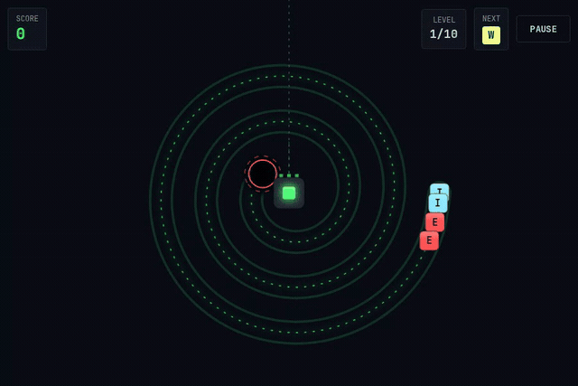
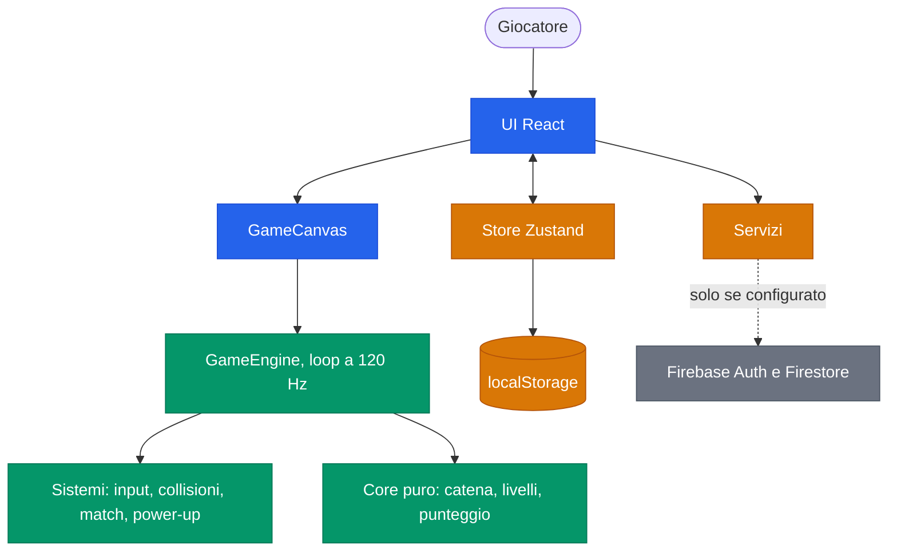
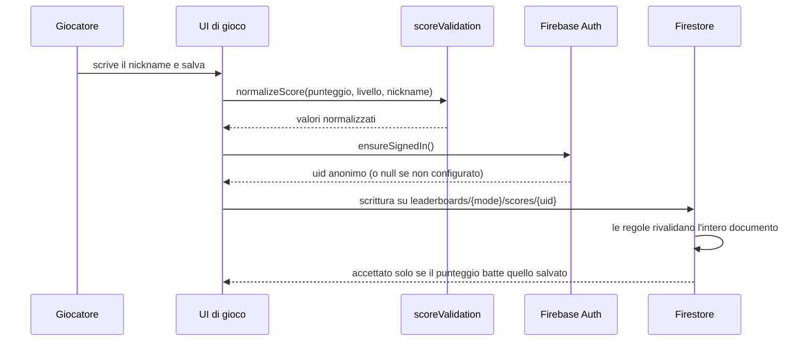
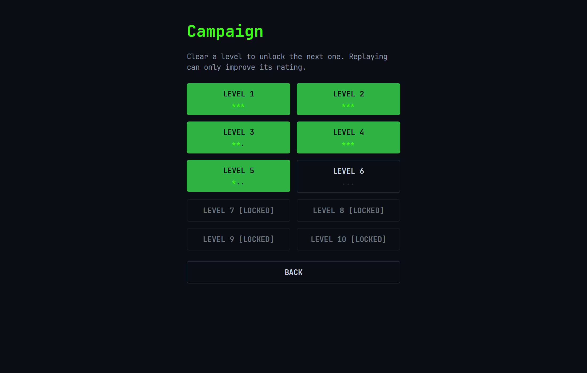

[English](./README.md) | **Italiano**

```
  ____                 ____
 / ___|___  _ __ ___  |  _ \ _   _ _ __ ___  _ __
| |   / _ \| '__/ _ \ | | | | | | | '_ ` _ \| '_ \
| |__| (_) | | |  __/ | |_| | |_| | | | | | | |_) |
 \____\___/|_|  \___| |____/ \__,_|_| |_| |_| .__/
                                            |_|
```

# Core Dump

Un puzzle game per browser in cui devi eliminare catene di pacchetti dati prima che raggiungano `/dev/null`, installabile come PWA offline.

[](https://github.com/AndreaBonn/core-dump-game/actions/workflows/ci.yml)
[](https://github.com/AndreaBonn/core-dump-game/actions/workflows/ci.yml)
[](https://github.com/AndreaBonn/core-dump-game/actions/workflows/ci.yml)
[](./LICENSE)
[](./.nvmrc)
[](./SECURITY.it.md)

I pacchetti dati percorrono un tracciato a circuito stampato verso un void al centro del tabellone. Tu controlli il cursore CPU piazzato davanti a quel void: miri, spari nella catena il pacchetto che hai in mano e allinei tre o più pacchetti dello stesso tipo per farli esplodere. Devi svuotare la catena prima che la sua testa arrivi al void.

Il gioco gira interamente nel browser e funziona offline. Firebase alimenta una classifica online opzionale: senza, ogni funzione di gioco resta disponibile e la classifica viene segnalata come non disponibile.

È un'implementazione originale del genere marble shooter. Non usa asset, nomi o codice di alcun gioco commerciale esistente.

## In pratica



Mira, colpo e avanzamento della catena verso il centro. La linea punteggiata è l'anteprima di traiettoria.

**Prima volta qui? Leggi la [guida su come si gioca](./docs/how-to-play.it.md)**: regole complete, comandi, power-up e come avviare il gioco senza sapere cos'è npm.

## Indice

- [Giocare senza installare niente di tecnico](#giocare-senza-installare-niente-di-tecnico)
- [Stack tecnologico](#stack-tecnologico)
- [Architettura](#architettura)
- [Prerequisiti](#prerequisiti)
- [Installazione](#installazione)
- [Configurazione](#configurazione)
- [Esecuzione locale](#esecuzione-locale)
- [Struttura del repository](#struttura-del-repository)
- [Contenuti di gioco](#contenuti-di-gioco)
- [Testing](#testing)
- [Deploy e CI/CD](#deploy-e-cicd)
- [Come contribuire](#come-contribuire)
- [Maintainer](#maintainer)
- [Sicurezza](#sicurezza)
- [Licenza](#licenza)
- [Supporta il progetto](#supporta-il-progetto)

## Giocare senza installare niente di tecnico

Installa [Node.js](https://nodejs.org) 20 o successivo, clona questo repository e avvia il gioco dalla cartella che hai clonato:

- Windows: doppio click su `play.cmd`
- macOS: doppio click su `play.command`
- Linux: esegui `./play.sh` da un terminale

Il primo avvio installa le dipendenze e compila il gioco: richiede qualche minuto e succede una volta sola. Gli avvii successivi aprono subito il browser. Dopo un `git pull`, lancialo con `--rebuild`.

Aprire `dist/index.html` dal file manager non funziona: i browser bloccano i module script su `file://`, quindi la pagina resta bianca senza alcun errore. Il launcher avvia un server web locale, che è ciò di cui il gioco ha bisogno.

La procedura completa, compreso cosa fare quando il launcher si rifiuta di partire, sta nella [guida su come si gioca](./docs/how-to-play.it.md).

## Stack tecnologico

**Frontend**

- React 18.3 con TypeScript 5.7 in modalità strict
- HTML5 Canvas 2D per tutto il rendering di gioco, senza librerie grafiche
- Zustand 5 per lo stato di menu, impostazioni e autenticazione, mai per lo stato di gioco per frame
- Tailwind CSS 3.4 per l'interfaccia attorno al canvas

**Build e tooling**

- Vite 6 con `vite-plugin-pwa` 0.21 per la build installabile offline
- Vitest 5 per i test unitari, Playwright 1.62 per gli end-to-end
- ESLint 9 e Prettier 3

**Backend (opzionale)**

- Firebase 11: Anonymous Auth e Firestore, caricati on demand
- Firebase Hosting per il deploy, con header di sicurezza e regole Firestore versionate nel repository

## Architettura



Il loop di gioco gira fuori da React e disegna direttamente sul canvas, quindi nessuno stato per frame attraversa l'albero dei componenti. Progressi e impostazioni vivono in `localStorage`. Firebase è una foglia del grafo: togliendolo, il resto continua a funzionare.

Il salvataggio di un punteggio è l'unico flusso che attraversa tutti i layer:



Le decisioni principali sono registrate come ADR in [`docs/adr/`](./docs/adr/): [architettura del core](./docs/adr/0001-core-architecture.md), [integrità della classifica](./docs/adr/0007-leaderboard-integrity.md), [viewport verticale](./docs/adr/0008-portrait-viewport.md).

## Prerequisiti

- Node.js 20 o successivo. `.nvmrc` fissa la 24, che è quella usata dalla CI.
- npm 10 o successivo.
- Firebase CLI e una JVM, solo per eseguire in locale i test delle regole di sicurezza Firestore.

## Installazione

1. Clona il repository:
   ```bash
   git clone https://github.com/AndreaBonn/core-dump-game.git
   cd core-dump-game
   ```
2. Installa le dipendenze:
   ```bash
   npm install
   ```
3. Avvia il server di sviluppo:
   ```bash
   npm run dev
   ```

Il server di sviluppo stampa un URL locale, per default `http://localhost:5173`.

## Configurazione

Il gioco non richiede configurazione per funzionare. Copia `.env.example` in `.env` solo se vuoi la classifica online:

| Nome                                | Obbligatoria | Descrizione                                                                |
| ----------------------------------- | ------------ | -------------------------------------------------------------------------- |
| `VITE_FIREBASE_API_KEY`             | ⚠️           | Chiave API Web di Firebase, da Impostazioni progetto, Generali, Le tue app |
| `VITE_FIREBASE_AUTH_DOMAIN`         | ⚠️           | Dominio di autenticazione del progetto Firebase                            |
| `VITE_FIREBASE_PROJECT_ID`          | ⚠️           | Id del progetto Firebase                                                   |
| `VITE_FIREBASE_STORAGE_BUCKET`      | ⚠️           | Bucket di storage del progetto                                             |
| `VITE_FIREBASE_MESSAGING_SENDER_ID` | ⚠️           | Id del sender di messaggistica                                             |
| `VITE_FIREBASE_APP_ID`              | ⚠️           | Id della web app                                                           |

Tutte e sei sono opzionali e vengono lette in fase di build, quindi vanno impostate prima di `npm run build` quando si fa deploy. Lasciandole vuote il gioco funziona offline con la classifica disattivata.

Per pubblicare le regole della classifica, copia `.firebaserc.example` in `.firebaserc`, inserisci l'id del tuo progetto ed esegui `firebase deploy --only firestore:rules`.

## Esecuzione locale

| Comando                 | Cosa fa                                                    |
| ----------------------- | ---------------------------------------------------------- |
| `npm run play`          | Installa e compila se serve, poi apre il gioco nel browser |
| `npm run dev`           | Server di sviluppo con hot reload sulla porta 5173         |
| `npm run build`         | Type-check, poi build in `dist/`                           |
| `npm run preview`       | Serve la build di produzione sulla porta 4173              |
| `npm test`              | Test unitari, una esecuzione                               |
| `npm run test:watch`    | Test unitari in watch mode                                 |
| `npm run test:coverage` | Test unitari con report di copertura                       |
| `npm run test:rules`    | Test delle regole di sicurezza Firestore sull'emulatore    |
| `npm run test:e2e`      | Suite end-to-end Playwright sulla build di produzione      |
| `npm run typecheck`     | `tsc --noEmit`                                             |
| `npm run lint`          | ESLint su tutto il repository                              |
| `npm run format`        | Prettier su tutto il repository                            |
| `npm run icons`         | Rigenera le icone della PWA                                |

## Struttura del repository

```text
src/
  components/   UI React: overlay di gioco (game/), menu (menu/), widget condivisi
  engine/       Loop di gioco, entità, sistemi, matematica, sintesi audio
  config/       Livelli, palette dei pacchetti, power-up, combo, costanti di tuning
  services/     Init Firebase, auth anonima, classifica, validazione punteggi
  store/        Store Zustand e persistenza su localStorage
  hooks/        Hook React che collegano engine e servizi ai componenti
  types/        Tipi TypeScript condivisi
tests/          Test unitari, speculari a src/
e2e/            Spec Playwright eseguite sulla build
docs/adr/       Architecture decision record
scripts/        Launcher per il giocatore e generazione icone PWA
specs/          Spec di feature e task list usate durante lo sviluppo
```

## Contenuti di gioco

| Modalità        | Che cos'è                                                                            |
| --------------- | ------------------------------------------------------------------------------------ |
| Campagna        | 10 livelli, ognuno sbloccato completando il precedente, valutati da una a tre stelle |
| Endless         | Nessun livello finale, la partita finisce quando la catena raggiunge il void         |
| Daily challenge | Tracciato derivato dalla data del giorno, identico per tutti in quella giornata      |
| Tutorial        | Quattro passi su mira, match, scambio e void. Parte da solo alla prima partita       |

Sette tipi di pacchetto che prendono il nome dai livelli di log, sette power-up (`sleep()`, `fork()`, `garbage collect`, `rollback()`, `kill -9`, `try/catch`, `regex`), 18 achievement e pacchetti ostacolo non abbinabili dal livello 4 in poi. Le regole sono spiegate nella [guida su come si gioca](./docs/how-to-play.it.md).



## Testing

I test unitari girano su Vitest con jsdom e vivono in `tests/`, speculari a `src/`. La suite copre il dominio di gioco puro (match sulla catena, punteggio, combo, generazione dei livelli, campionamento del tracciato, effetti dei power-up, validazione dei punteggi, store, servizi) più il comportamento dei componenti React tramite Testing Library. Il disegno sul canvas è escluso dalla copertura per scelta.

```bash
npm test
npm run test:coverage
```

Le soglie di copertura sono applicate in `vite.config.ts` (95% righe e statement, 92% funzioni e branch), così la stessa esecuzione fallisce in locale e in CI.

Due suite richiedono più di Node:

```bash
npm run test:rules   # emulatore Firestore, richiede Firebase CLI e una JVM
npm run test:e2e     # Playwright, compila l'app e la serve sulla porta 4173
```

La suite end-to-end gira sulla build di produzione in due progetti, Chrome desktop a 1280x800 e Pixel 5 a 375x700, perché service worker e chunking esistono solo lì.

## Deploy e CI/CD

[`.github/workflows/ci.yml`](./.github/workflows/ci.yml) esegue tre job a ogni push e pull request verso `main`:

- **verify**: lint, type-check, test con copertura, build di produzione
- **rules**: test delle regole di sicurezza Firestore sull'emulatore, su un runner con JVM
- **e2e**: suite Playwright, con il report HTML caricato come artifact

Dependabot ([`.github/dependabot.yml`](./.github/dependabot.yml)) apre aggiornamenti settimanali raggruppati per npm e GitHub Actions.

Il deploy è su Firebase Hosting:

```bash
npm run build
firebase deploy --only hosting
```

`firebase.json` imposta gli header di sicurezza (CSP, HSTS, `X-Content-Type-Options`, `X-Frame-Options`, `Referrer-Policy`) e la politica di cache: immutabile per gli asset con hash, no-cache per `index.html`.

## Come contribuire

Non esiste un `CONTRIBUTING.md`. I gate che una modifica deve superare sono i tre job di CI qui sopra; eseguire in locale `npm run lint`, `npm run typecheck` e `npm run test:coverage` riproduce il primo. I test stanno accanto al codice che coprono, con `tests/` speculare a `src/`.

## Maintainer

[Andrea Bonacci](https://github.com/AndreaBonn)

## Sicurezza

La classifica è l'unica parte del gioco che accetta input esterno, ed è validata sia nel client sia nelle regole Firestore. Per segnalare una vulnerabilità, consulta [SECURITY.it.md](./SECURITY.it.md).

## Licenza

Distribuito con licenza Apache 2.0. Vedi [LICENSE](./LICENSE).

## Supporta il progetto

Se il gioco ti è piaciuto o il codice ti è stato utile, lascia una stella su [GitHub](https://github.com/AndreaBonn/core-dump-game). Aiuta altri a scoprirlo.

Core Dump è gratuita. Se ti è utile e vuoi contribuire, puoi lasciare un'offerta tramite PayPal. L'importo lo scegli tu ed è del tutto facoltativo.

<p align="center">
  <a href="https://paypal.me/AndreaBonacci19"></a>
</p>
