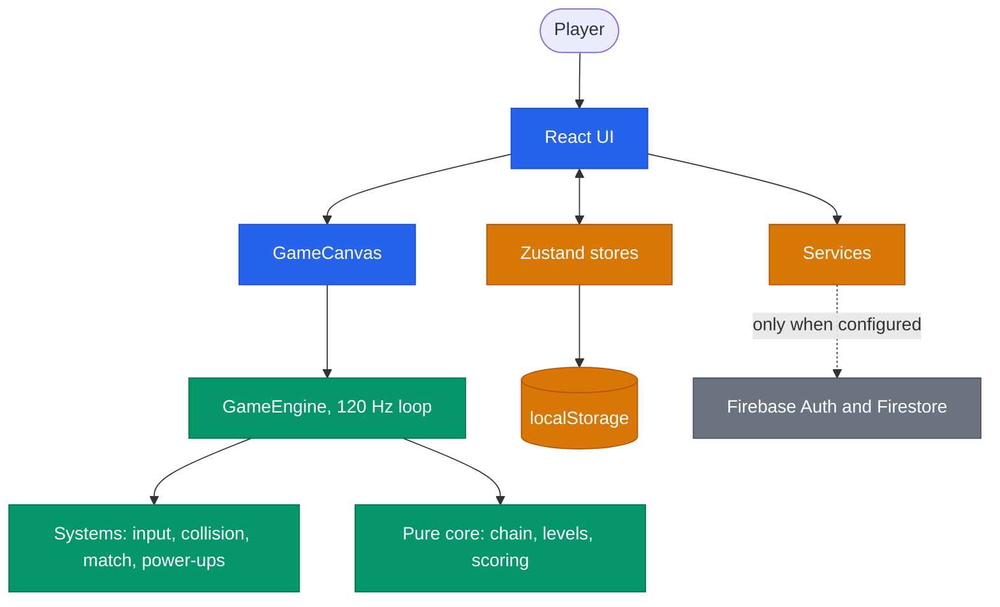
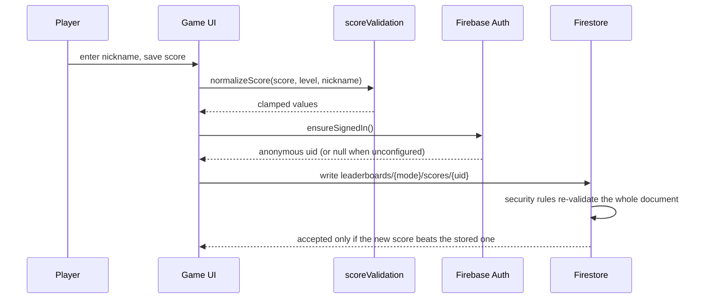

**English** | [Italiano](./README.it.md)

```
  ____                 ____
 / ___|___  _ __ ___  |  _ \ _   _ _ __ ___  _ __
| |   / _ \| '__/ _ \ | | | | | | | '_ ` _ \| '_ \
| |__| (_) | | |  __/ | |_| | |_| | | | | | | |_) |
 \____\___/|_|  \___| |____/ \__,_|_| |_| |_| .__/
                                            |_|
```

# Core Dump

A browser puzzle game where you clear chains of data packets before they reach `/dev/null`, installable as an offline PWA.

[](https://github.com/AndreaBonn/core-dump-game/actions/workflows/ci.yml)
[](https://github.com/AndreaBonn/core-dump-game/actions/workflows/ci.yml)
[](https://github.com/AndreaBonn/core-dump-game/actions/workflows/ci.yml)
[](./LICENSE)
[](./.nvmrc)
[](./SECURITY.md)

Data packets travel along a printed-circuit track toward a void at the centre of the board. You control the CPU cursor sitting in front of that void: aim, fire the packet you are holding into the chain, and line up three or more of the same type to make them explode. Clear the chain before its front reaches the void.

The game runs entirely in the browser and works offline. Firebase powers an optional online leaderboard; without it, every gameplay feature still works and the leaderboard shows as unavailable.

This is an original implementation of the marble-shooter genre. No assets, names, or code from any existing commercial game are used.

## In practice


Aiming, firing, and the chain advancing toward the centre. The dotted line is the trajectory preview.

**New here? Read the [How to play guide](./docs/how-to-play.md)** for the full rules, controls, power-ups, and how to start the game without knowing npm.

## Contents

- [Play it without installing anything technical](#play-it-without-installing-anything-technical)
- [Tech stack](#tech-stack)
- [Architecture](#architecture)
- [Prerequisites](#prerequisites)
- [Installation](#installation)
- [Configuration](#configuration)
- [Running locally](#running-locally)
- [Repository structure](#repository-structure)
- [Game content](#game-content)
- [Testing](#testing)
- [Deployment and CI/CD](#deployment-and-cicd)
- [Contributing](#contributing)
- [Maintainer](#maintainer)
- [Security](#security)
- [License](#license)
- [Support the project](#support-the-project)

## Play it without installing anything technical

Install [Node.js](https://nodejs.org) 20 or newer, clone this repository, then start the game from the folder you cloned:

- Windows: double-click `play.cmd`
- macOS: double-click `play.command`
- Linux: run `./play.sh` from a terminal

The first run installs dependencies and builds the game, which takes a few minutes and happens once. Later runs open the browser straight away. After a `git pull`, start it with `--rebuild`.

Opening `dist/index.html` from a file manager does not work: browsers block module scripts on `file://`, so the page stays blank with no error. The launcher starts a local web server, which is what the game needs.

The full walkthrough, including what to do when the launcher refuses to start, is in the [How to play guide](./docs/how-to-play.md).

## Tech stack

**Frontend**

- React 18.3 with TypeScript 5.7 in strict mode
- HTML5 Canvas 2D for all game rendering, no rendering library
- Zustand 5 for menu, settings, and auth state, never for per-frame game state
- Tailwind CSS 3.4 for the interface around the canvas

**Build and tooling**

- Vite 6 with `vite-plugin-pwa` 0.21 for the offline installable build
- Vitest 5 for unit tests, Playwright 1.62 for end-to-end
- ESLint 9 and Prettier 3

**Backend (optional)**

- Firebase 11: Anonymous Auth and Firestore, loaded on demand
- Firebase Hosting for deployment, with security headers and Firestore rules in the repo

## Architecture



The game loop runs outside React and draws straight to the canvas, so no per-frame state passes through the component tree. Progress and settings live in `localStorage`. Firebase is a leaf of the graph: remove it and the rest keeps working.

Saving a score is the one flow that crosses every layer:



Key decisions are recorded as ADRs in [`docs/adr/`](./docs/adr/): [core architecture](./docs/adr/0001-core-architecture.md), [leaderboard integrity](./docs/adr/0007-leaderboard-integrity.md), [portrait viewport](./docs/adr/0008-portrait-viewport.md).

## Prerequisites

- Node.js 20 or newer. `.nvmrc` pins 24, which is what CI uses.
- npm 10 or newer.
- Firebase CLI and a JVM, only to run the Firestore security-rules tests locally.

## Installation

1. Clone the repository:
   ```bash
   git clone https://github.com/AndreaBonn/core-dump-game.git
   cd core-dump-game
   ```
2. Install dependencies:
   ```bash
   npm install
   ```
3. Start the dev server:
   ```bash
   npm run dev
   ```

The dev server prints a local URL, `http://localhost:5173` by default.

## Configuration

The game needs no configuration to run. Copy `.env.example` to `.env` only if you want the online leaderboard:

| Name                                | Required | Description                                                     |
| ----------------------------------- | -------- | --------------------------------------------------------------- |
| `VITE_FIREBASE_API_KEY`             | ⚠️       | Firebase Web API key, from Project settings, General, Your apps |
| `VITE_FIREBASE_AUTH_DOMAIN`         | ⚠️       | Auth domain of the Firebase project                             |
| `VITE_FIREBASE_PROJECT_ID`          | ⚠️       | Firebase project id                                             |
| `VITE_FIREBASE_STORAGE_BUCKET`      | ⚠️       | Storage bucket of the project                                   |
| `VITE_FIREBASE_MESSAGING_SENDER_ID` | ⚠️       | Messaging sender id                                             |
| `VITE_FIREBASE_APP_ID`              | ⚠️       | Web app id                                                      |

All six are optional and read at build time, so set them before `npm run build` when deploying. Leave them empty and the game runs offline with the leaderboard disabled.

To deploy the leaderboard rules, copy `.firebaserc.example` to `.firebaserc`, set your project id, then run `firebase deploy --only firestore:rules`.

## Running locally

| Command                 | What it does                                                   |
| ----------------------- | -------------------------------------------------------------- |
| `npm run play`          | Install and build if needed, then open the game in the browser |
| `npm run dev`           | Dev server with hot reload on port 5173                        |
| `npm run build`         | Type-check, then build to `dist/`                              |
| `npm run preview`       | Serve the production build on port 4173                        |
| `npm test`              | Unit tests, one run                                            |
| `npm run test:watch`    | Unit tests in watch mode                                       |
| `npm run test:coverage` | Unit tests with a coverage report                              |
| `npm run test:rules`    | Firestore security-rules tests against the emulator            |
| `npm run test:e2e`      | Playwright end-to-end suite against the production build       |
| `npm run typecheck`     | `tsc --noEmit`                                                 |
| `npm run lint`          | ESLint over the repository                                     |
| `npm run format`        | Prettier over the repository                                   |
| `npm run icons`         | Regenerate the PWA icons                                       |

## Repository structure

```text
src/
  components/   React UI: game overlays (game/), menus (menu/), shared widgets
  engine/       Game loop, entities, systems, math, audio synthesis
  config/       Levels, packet palette, power-ups, combos, tuning constants
  services/     Firebase init, anonymous auth, leaderboard, score validation
  store/        Zustand stores and localStorage persistence
  hooks/        React hooks bridging engine and services to components
  types/        Shared TypeScript types
tests/          Unit tests, mirroring src/
e2e/            Playwright specs run against the built app
docs/adr/       Architecture decision records
scripts/        Player launcher and PWA icon generation
specs/          Feature specs and task lists used during development
```

## Game content

| Mode            | What it is                                                                           |
| --------------- | ------------------------------------------------------------------------------------ |
| Campaign        | 10 levels, each unlocked by clearing the previous one, rated one to three stars      |
| Endless         | No final level, the run ends when the chain reaches the void                         |
| Daily challenge | Layout seeded from the calendar date, identical for everyone that day                |
| Tutorial        | Four steps covering aim, match, swap, and the void. Runs automatically on first play |

Seven packet types named after log levels, seven power-ups (`sleep()`, `fork()`, `garbage collect`, `rollback()`, `kill -9`, `try/catch`, `regex`), 18 achievements, and unmatchable hazard packets from level 4 onward. The rules are explained in the [How to play guide](./docs/how-to-play.md).


## Testing

Unit tests run on Vitest with jsdom, and live in `tests/`, mirroring `src/`. The suite covers the pure game domain (chain matching, scoring, combos, level generation, path sampling, power-up effects, score validation, stores, services) plus React component behaviour through Testing Library. Canvas painting is excluded from coverage by design.

```bash
npm test
npm run test:coverage
```

Coverage thresholds are enforced in `vite.config.ts` (95% lines and statements, 92% functions and branches), so the same run fails locally and in CI.

Two suites need more than Node:

```bash
npm run test:rules   # Firestore emulator, needs the Firebase CLI and a JVM
npm run test:e2e     # Playwright, builds the app and serves it on port 4173
```

The end-to-end suite runs against the production build in two projects, desktop Chrome at 1280x800 and Pixel 5 at 375x700, because the service worker and chunking only exist there.

## Deployment and CI/CD

[`.github/workflows/ci.yml`](./.github/workflows/ci.yml) runs three jobs on every push and pull request to `main`:

- **verify**: lint, type-check, tests with coverage, production build
- **rules**: Firestore security-rules tests against the emulator, on a JVM runner
- **e2e**: Playwright suite, with the HTML report uploaded as an artifact

Dependabot ([`.github/dependabot.yml`](./.github/dependabot.yml)) opens weekly grouped updates for npm and GitHub Actions.

Deployment targets Firebase Hosting:

```bash
npm run build
firebase deploy --only hosting
```

`firebase.json` sets the security headers (CSP, HSTS, `X-Content-Type-Options`, `X-Frame-Options`, `Referrer-Policy`) and the cache policy: immutable for hashed assets, no-cache for `index.html`.

## Contributing

There is no `CONTRIBUTING.md`. The gates a change has to pass are the three CI jobs above; running `npm run lint`, `npm run typecheck`, and `npm run test:coverage` locally reproduces the first one. Tests live beside the code they cover, mirroring `src/` under `tests/`.

## Maintainer

[Andrea Bonacci](https://github.com/AndreaBonn)

## Security

The leaderboard is the only part of the game that accepts external input, and it is validated both in the client and in the Firestore rules. To report a vulnerability, see [SECURITY.md](./SECURITY.md).

## License

Released under the Apache License 2.0. See [LICENSE](./LICENSE).

## Support the project

If you enjoyed the game or found the code useful, consider giving it a star on [GitHub](https://github.com/AndreaBonn/core-dump-game). It helps other people find it.
