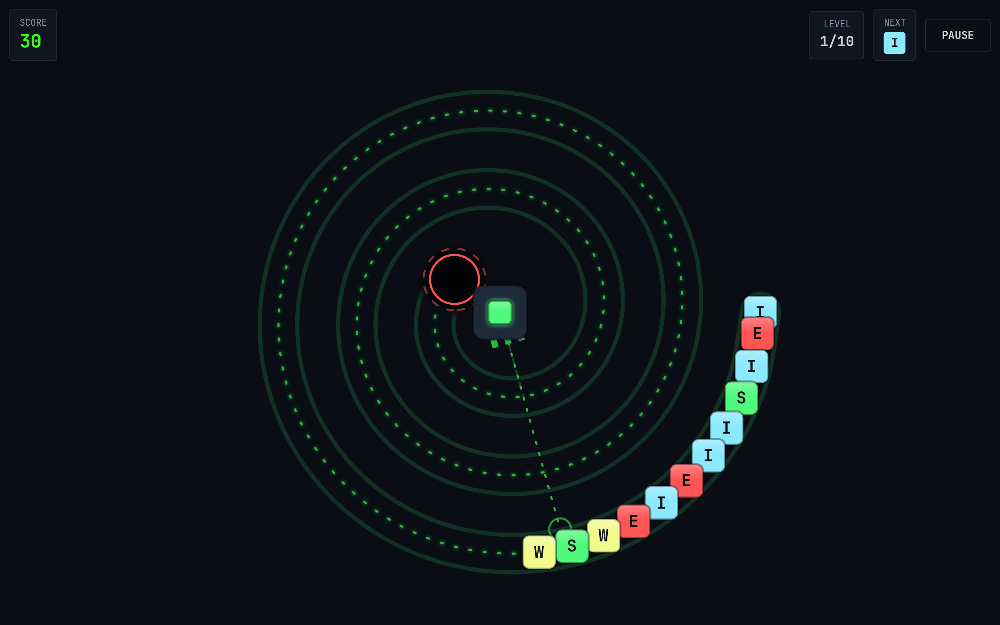
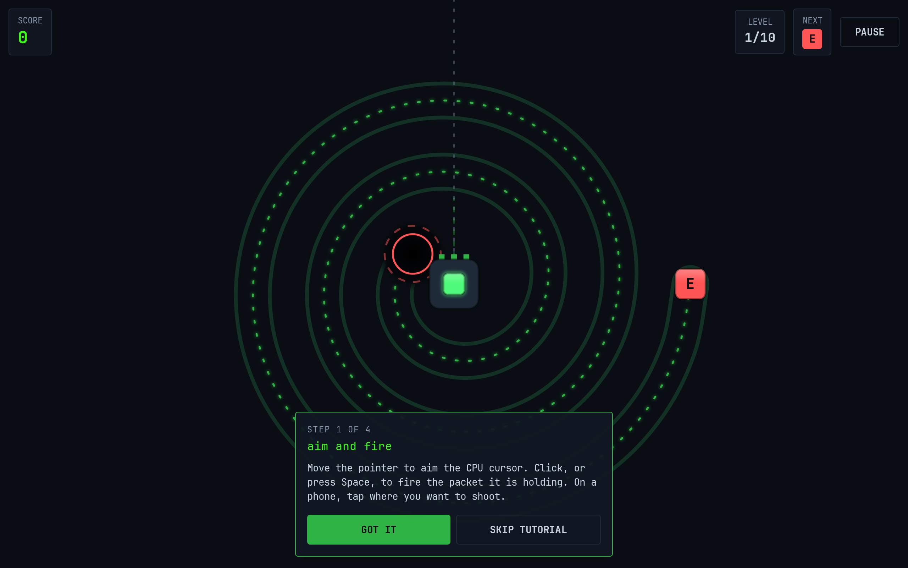
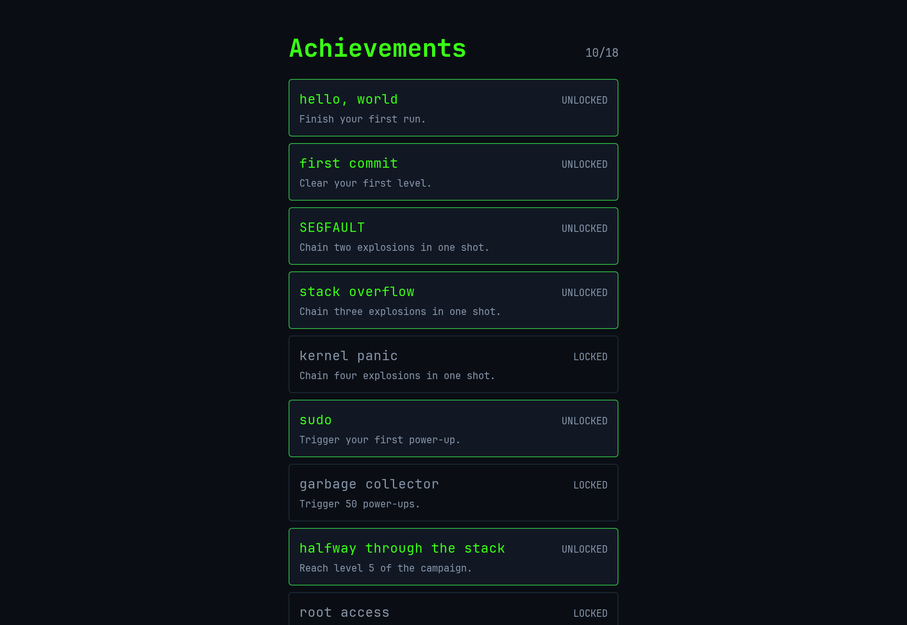
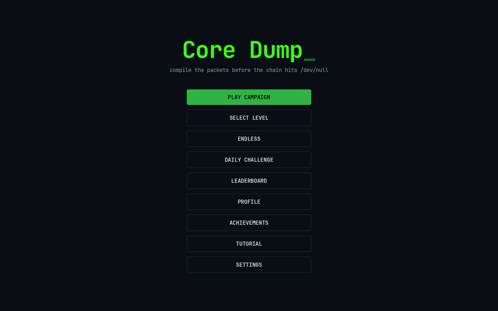
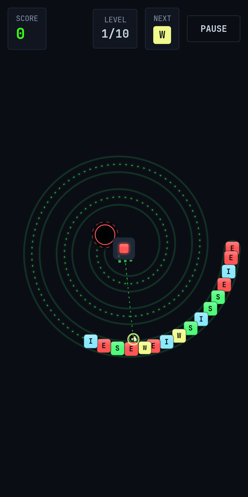

[English](./how-to-play.md) | **Italiano**

# Come si gioca a Core Dump

Tutto quello che serve per avviare il gioco e giocarci bene: come partire da zero, le regole, i comandi e cosa fa ogni power-up. Non serve saper programmare.

Torna al [README](../README.it.md).

## Indice

- [Avviare il gioco](#avviare-il-gioco)
- [Quando il launcher non parte](#quando-il-launcher-non-parte)
- [Installarlo come app](#installarlo-come-app)
- [Il tabellone](#il-tabellone)
- [Le regole](#le-regole)
- [Comandi](#comandi)
- [Tipi di pacchetto](#tipi-di-pacchetto)
- [Combo](#combo)
- [Power-up](#power-up)
- [Pacchetti ostacolo](#pacchetti-ostacolo)
- [Punteggio e stelle](#punteggio-e-stelle)
- [Modalità di gioco](#modalità-di-gioco)
- [Achievement](#achievement)
- [La classifica online](#la-classifica-online)
- [Impostazioni e dati personali](#impostazioni-e-dati-personali)

## Avviare il gioco

Serve Node.js, che è ciò che fa girare il server web locale da cui il gioco viene servito. Non serve saperlo usare.

**Prerequisiti: un computer con Windows, macOS o Linux e circa 400 MB di spazio libero su disco.**

1. Installa Node.js 20 o successivo da <https://nodejs.org>. Prendi la versione indicata come LTS e accetta le impostazioni predefinite dell'installer.
   Dovresti vedere: l'installazione che termina senza errori.
   Se hai già Node.js, salta questo passo.

2. Scarica il gioco. In un terminale:

   ```bash
   git clone https://github.com/AndreaBonn/core-dump-game.git
   ```

   Dovresti vedere: una cartella `core-dump-game` nella directory da cui hai lanciato il comando.
   Se compare `git: command not found`, installa Git da <https://git-scm.com> e ripeti il comando. Va bene anche scaricare lo ZIP da GitHub, ma su macOS costa un passaggio di permessi in più.

3. Entra nella cartella appena creata:

   ```bash
   cd core-dump-game
   ```

4. Avvia il gioco. Il comando dipende dal sistema:
   - Windows: doppio click su `play.cmd` nella cartella
   - macOS: doppio click su `play.command` nella cartella
   - Linux: esegui `./play.sh` dal terminale (il doppio click di solito non lo lancia)

   Dovresti vedere: una finestra di terminale con i messaggi di avanzamento, poi il browser che si apre sul gioco.
   Il primo avvio installa le dipendenze e compila il gioco: richiede qualche minuto e succede una volta sola.

5. Gioca. Gli avvii successivi saltano la compilazione e aprono subito il browser.

Dopo aver aggiornato il gioco con `git pull`, avvialo una volta con il flag `--rebuild`, così la nuova versione viene compilata:

```bash
./play.sh --rebuild
```

## Quando il launcher non parte

| Cosa vedi                                                    | Cosa significa                                              | Cosa fare                                                                                |
| ------------------------------------------------------------ | ----------------------------------------------------------- | ---------------------------------------------------------------------------------------- |
| `Node.js is not installed, and the game needs it to run.`    | Node.js manca oppure non è nel PATH                         | Installalo da <https://nodejs.org>, chiudi il terminale e riavvia il launcher            |
| `This game needs Node.js 20 or newer, and found version 16.` | Node.js è troppo vecchio                                    | Installa una versione aggiornata dallo stesso indirizzo                                  |
| macOS si rifiuta di aprire `play.command`                    | Il file arriva da uno ZIP e macOS lo ha messo in quarantena | Autorizzalo in Impostazioni di sistema, Privacy e sicurezza. Con `git clone` non succede |
| Su Linux il doppio click non fa niente                       | Quasi nessun desktop esegue script al doppio click          | Lancia `./play.sh` da un terminale                                                       |
| Pagina bianca nel browser                                    | Il gioco è stato aperto dal file manager e non dal launcher | Chiudi la scheda e usa il launcher. I browser bloccano i module script su `file://`      |

## Installarlo come app

Il gioco è una PWA, quindi il browser può installarlo come un'applicazione vera: finestra propria, funziona offline, mantiene i progressi.

1. Avvia il gioco con il launcher.
2. Su Chrome o Edge, premi l'icona di installazione nella barra degli indirizzi. Su Safari usa Condividi, poi Aggiungi al Dock. Su Android usa il menu del browser, poi Installa app.
3. Dovresti vedere: Core Dump nell'elenco delle applicazioni, che si apre in una finestra sua.

Quando esce una nuova versione il gioco chiede prima di aggiornare, invece di ricaricare il tabellone a partita in corso.

## Il tabellone



- **Il tracciato** è la spirale punteggiata. I pacchetti la percorrono verso il centro.
- **Il void** è il cerchio nero al centro, bordato di rosso. Quando la testa della catena lo raggiunge, la partita finisce.
- **Il cursore CPU** è il quadrato accanto al void e tiene il pacchetto che stai per sparare.
- **L'HUD** mostra in alto a sinistra il punteggio, in alto a destra il livello, il pacchetto successivo e il pulsante di pausa.

## Le regole

1. Una catena di pacchetti dati avanza lungo il tracciato verso il void.
2. Dal cursore CPU spari pacchetti dentro la catena. Il pacchetto sparato si inserisce nel punto in cui arriva.
3. Tre o più pacchetti dello stesso tipo in fila esplodono e vengono rimossi. Tutto quello che sta dietro scorre in avanti e chiude il buco.
4. Se lo scorrimento allinea altri tre uguali, esplodono anche quelli: è una combo e vale un moltiplicatore.
5. Svuota tutta la catena per finire il livello. Se arriva al void, la partita è finita.

La linea punteggiata che parte dal cursore è l'anteprima di traiettoria: mostra dove finirà il colpo prima che tu lo spari.

## Comandi

| Azione                                           | Desktop                              | Touch                        |
| ------------------------------------------------ | ------------------------------------ | ---------------------------- |
| Mirare                                           | Muovi il mouse                       | Tocca dove vuoi sparare      |
| Sparare                                          | Click sinistro, oppure `Space`       | Lo stesso tocco mira e spara |
| Scambiare il pacchetto in mano con il successivo | Click destro, oppure `S`             | Non disponibile              |
| Mettere in pausa                                 | Il pulsante `PAUSE` in alto a destra | Lo stesso pulsante           |

Lo scambio è il comando che sfugge a quasi tutti. L'HUD mostra il pacchetto successivo: quando quello che hai in mano non serve, scambialo invece di sprecarlo nella catena.

## Tipi di pacchetto

I pacchetti prendono il nome dai livelli di log. Ogni livello usa solo i primi tipi dell'elenco, e i livelli successivi ne aggiungono: è questo che li rende più difficili.

| Tipo      | Etichetta | Colore  |
| --------- | --------- | ------- |
| `ERROR`   | E         | rosso   |
| `SUCCESS` | S         | verde   |
| `INFO`    | I         | ciano   |
| `WARNING` | W         | giallo  |
| `DEBUG`   | D         | viola   |
| `TRACE`   | T         | arancio |
| `FATAL`   | F         | rosa    |

## Combo

Le esplosioni concatenate da un solo colpo valgono un moltiplicatore e mostrano un'etichetta a schermo:

| Esplosioni da un colpo | Etichetta         | Moltiplicatore |
| ---------------------- | ----------------- | -------------- |
| 2                      | `SEGFAULT!`       | x2             |
| 3                      | `STACK OVERFLOW!` | x3             |
| 4 o più                | `KERNEL PANIC!!`  | da x4 in su    |

Su una esplosione concatenata il gioco si congela per un istante, più a lungo quanto più la combo cresce. La pausa è voluta: è ciò che rende leggibile una cascata lunga.

## Power-up

Alcuni pacchetti portano un power-up, segnato da un glifo. Si attivano quando il pacchetto fa parte di un match, non quando lo spari. Circa un pacchetto su venti è un power-up.

| Power-up          | Glifo | Effetto                                                                                                               |
| ----------------- | ----- | --------------------------------------------------------------------------------------------------------------------- |
| `sleep()`         | z     | Rallenta la catena a circa un terzo della velocità per 5 secondi                                                      |
| `fork()`          | Y     | Il colpo successivo spara tre pacchetti a ventaglio                                                                   |
| `garbage collect` | #     | Rimuove tutti i pacchetti di un tipo, scelto a caso fra quelli presenti nella catena                                  |
| `rollback()`      | <     | Spinge la catena indietro lungo il tracciato                                                                          |
| `kill -9`         | K     | Distrugge i cinque pacchetti più vicini al void                                                                       |
| `try/catch`       | T     | Protegge la partita: la prossima volta che la catena raggiunge il void viene respinta invece di far finire la partita |
| `regex`           | \*    | Rimuove tutti i pacchetti del tipo più presente nella catena                                                          |

## Pacchetti ostacolo

Dal livello 4 in poi la catena contiene pacchetti che non si possono abbinare. Non formano una sequenza e non ne allungano una, quindi spezzano la catena in segmenti da svuotare aggirandoli. La loro densità cresce con il livello e si ferma attorno a un pacchetto su otto, cosa che impedisce a un livello di diventare invincibile.

## Punteggio e stelle

- Un match di esattamente tre pacchetti vale 30 punti. Ogni pacchetto in più nella stessa esplosione ne aggiunge 15.
- Ogni esplosione successiva nello stesso colpo moltiplica quel valore per la propria posizione nella catena di esplosioni.
- Completare un livello senza lasciare arrivare nessun pacchetto al void aggiunge un bonus di 500 punti.

Ogni livello della campagna ha tre soglie di punteggio che valgono una, due e tre stelle. Le stelle si calcolano sul punteggio di quel livello soltanto, così una partita lunga non regala tre stelle all'ultimo livello. Rigiocare un livello può solo migliorarne la valutazione.

## Modalità di gioco

| Modalità            | Come funziona                                                                                                                    |
| ------------------- | -------------------------------------------------------------------------------------------------------------------------------- |
| **Campagna**        | 10 livelli. Completarne uno sblocca il successivo. Ognuno viene valutato da una a tre stelle                                     |
| **Endless**         | I livelli continuano senza un livello finale. La partita finisce quando la catena raggiunge il void                              |
| **Daily challenge** | Il tracciato deriva dalla data del giorno: chi gioca nello stesso giorno trova la stessa partita, e una data dà sempre la stessa |
| **Tutorial**        | Quattro passi: mira e spara, allinea tre, scambia la coda, tieni la linea. Parte da solo alla prima partita e resta nel menu     |



## Achievement

Sono 18 e si sbloccano giocando, non macinando un solo numero. Coprono i primi passi (`hello, world`, `first commit`), le combo (`SEGFAULT`, `stack overflow`, `kernel panic`), i power-up (`sudo`, `garbage collector`), l'avanzamento in campagna (`halfway through the stack`, `root access`), le stelle (`clean build`, `code quality`, `fully optimised`), la quantità di partite (`uptime`, `daemon`), la profondità in endless (`memory leak`, `no OOM killer`), la daily challenge (`cron job`) e il punteggio (`five figures`).

La schermata Achievements mostra quali hai ottenuto e cosa chiedono gli altri.



## La classifica online

La classifica online è opzionale e richiede un progetto Firebase configurato. Senza, la voce di menu resta visibile e segnala che la funzione non è disponibile; per il resto non cambia niente.

Quando è configurata:

- L'accesso è anonimo. Non c'è un account da creare, nessuna password, nessuna email.
- Salvare un punteggio invia il nickname che scrivi, il punteggio, il livello raggiunto e l'identificativo anonimo dell'account. Nient'altro.
- Ogni giocatore ha una sola riga per modalità, e quella riga può solo salire: un punteggio nuovo viene registrato solo se batte quello già presente.
- I nickname sono limitati a 24 caratteri.

## Impostazioni e dati personali

Progressi, stelle, statistiche e impostazioni restano nel browser e non lasciano mai il dispositivo. In Settings ci sono il nickname usato in classifica e l'interruttore dell'audio.

In Settings, alla voce Privacy and your data, puoi cancellare tutto: il profilo locale e, se ne hai salvata una, la riga in classifica. Il gioco torna allo stato di prima partita.



## Su telefono

Il tabellone si adatta allo schermo verticale: l'area di gioco quadrata viene scalata sulla larghezza invece di usare il tabellone orizzontale intero, così il gioco riempie lo schermo e non resta in una striscia. Si tocca per mirare e sparare in un gesto solo. Lo scambio del pacchetto in mano non è disponibile sul touch.


